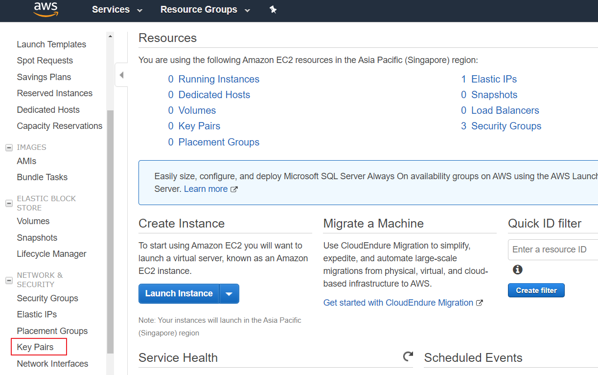
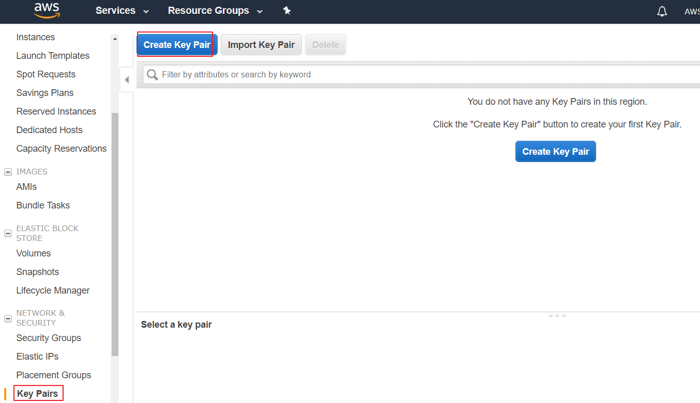
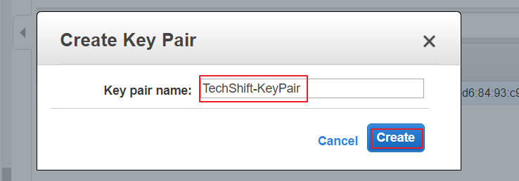
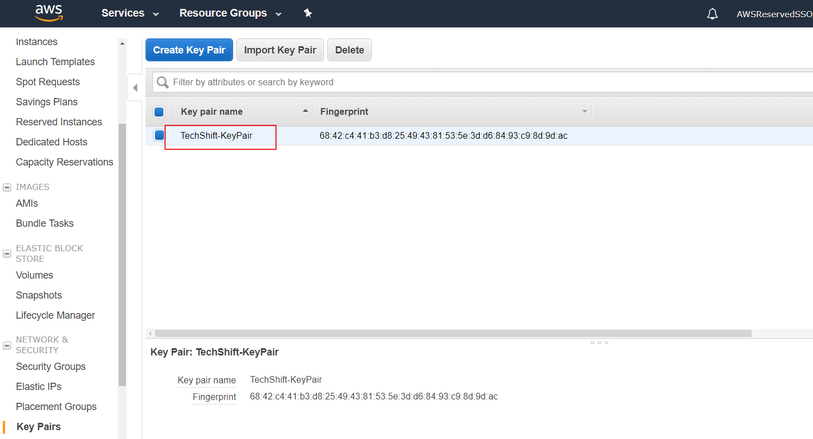

### Creating an EC2 Key Pair

First we need to create a key pair that will be used to establish an SSH
connection.

1)  Go to the *Key Pairs* in the EC2 instances console



2)  Click on the *Create Key Pair* button



3)  Key in *TechShift-KeyPair* in the name box.



4)  Now you will be able to see the key pair in the console and it will be in your *Downloads* folder.



### Create a Cloud9 environment

1) Go to the Cloud9 console and press *Create environment*.


2) Provide a name for your environment - you can name it ___BKKSecurity___


3) Leave all the parameters untouched and press *Next Steps*.


4) Review the settings and press *Create environment*.


5) Now you have an IDE in the cloud.


6) Click on *Open IDE*

7)In the Terminal type teh following commands

```
git clone https://github.com/andyliza/aws-security-workshop.git

```


8) Once the repository is cloned, please depoloy the CloudFormation template using the following command:

```
aws cloudformation create-stack --template-body file://./aws-security-workshop/Cloudformation/security-workshop.json --stack-name bkksecuritychallenge2019 --capabilities CAPABILITY_NAMED_IAM --parameters ParameterKey=InstanceType,ParameterValue=t2.small ParameterKey=KeyName,ParameterValue=BKKSecurity ParameterKey=RDSPassword,ParameterValue=secID2019 ParameterKey=RDSUsername,ParameterValue=admin ParameterKey=VPCCIDR,ParameterValue=172.4.0.0/16

```

9) Once the installation begins you can check the status of the deployement using this command:

```
aws cloudformation describe-stacks --stack-name bkksecuritychallenge2019 \
                                   --query 'Stacks[0].StackStatus' \
                                   --output text
```


 **:heavy_exclamation_mark: DO NOT move past this point until you see CREATE_COMPLETE as the status for your CloudFormation stack**

10) When you see that the operation has been completed successfully move to the [first lab (CloudTrail)](../01-CloudTrail-Lab/README.md)
