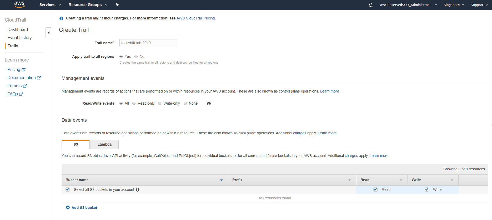
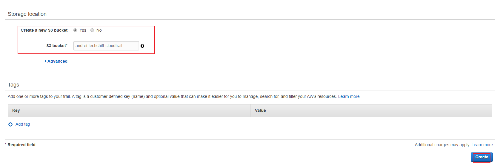

### CloudTrail

Create CloudTrail

1)  In the search bar type *CloudTrail*. Once in press *Create Trail*.

2)  In the creation wizard add a name for the trail `security-id-ct-demo`. Make
    sure the trail is applied to all regions. Also make sure that all s3 buckets
    are audited.

    
    1. Read/Write events -> All
    2. Log AWS KMS events -> Yes
    3. Insights events -> Yes
    4. Data Events: 
        * S3: Select all S3 buckets in your account 
        * Lambda: Log all current and future functions
    5. Storage location: 
        * Create a new s3 bucket: Yes
        * S3 bucket: `security-id-cloudtrail-logs-<YOUR ACCOUNT ID>-us-east-1`

4)  Once done make sure that the S3 bucket is created.

Access the S3 bucket and make sure that the logs are being created.

Explore the contents of the CloudTrail Logs. 

Proceed to the [next lab (GuardDuty)](../02-GuardDuty-Lab/README.md)
