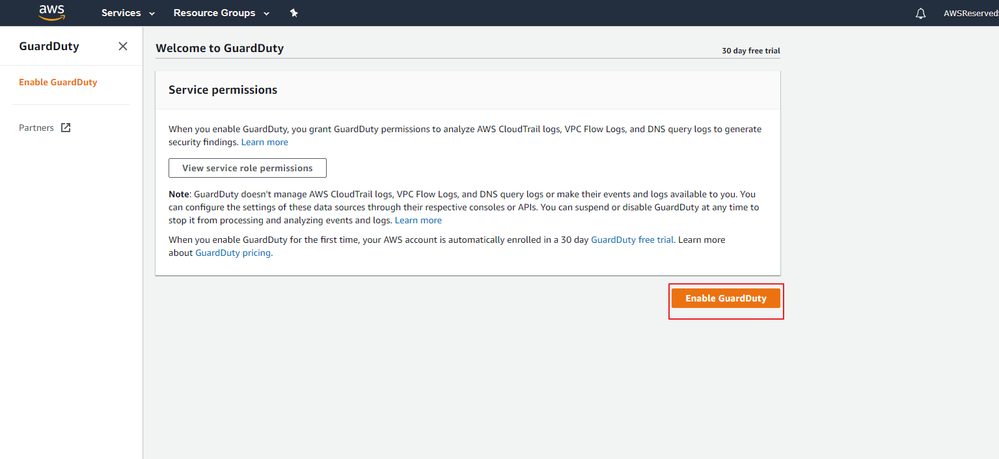

#### Configuring Amazon GuardDuty

1)  Go to the AWS GuardDuty console

2)  Press *Get Started*.

3)  Click on *Enable GuardDuty* and you are done.

4)  GuarDuty is enabled on the account.

Proceed to the [next lab (Config Lab)](../03-Config-Lab/README.md)
