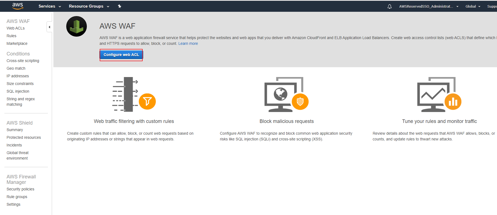
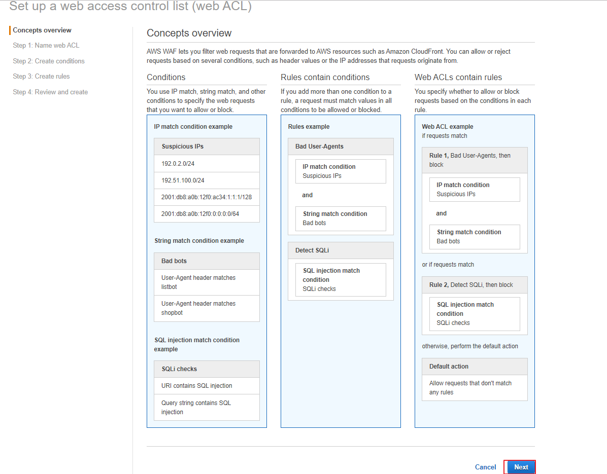
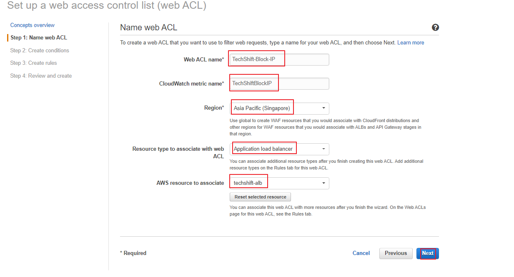
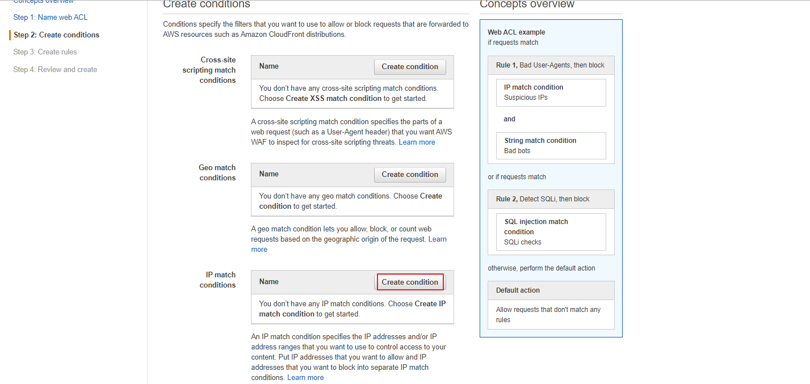
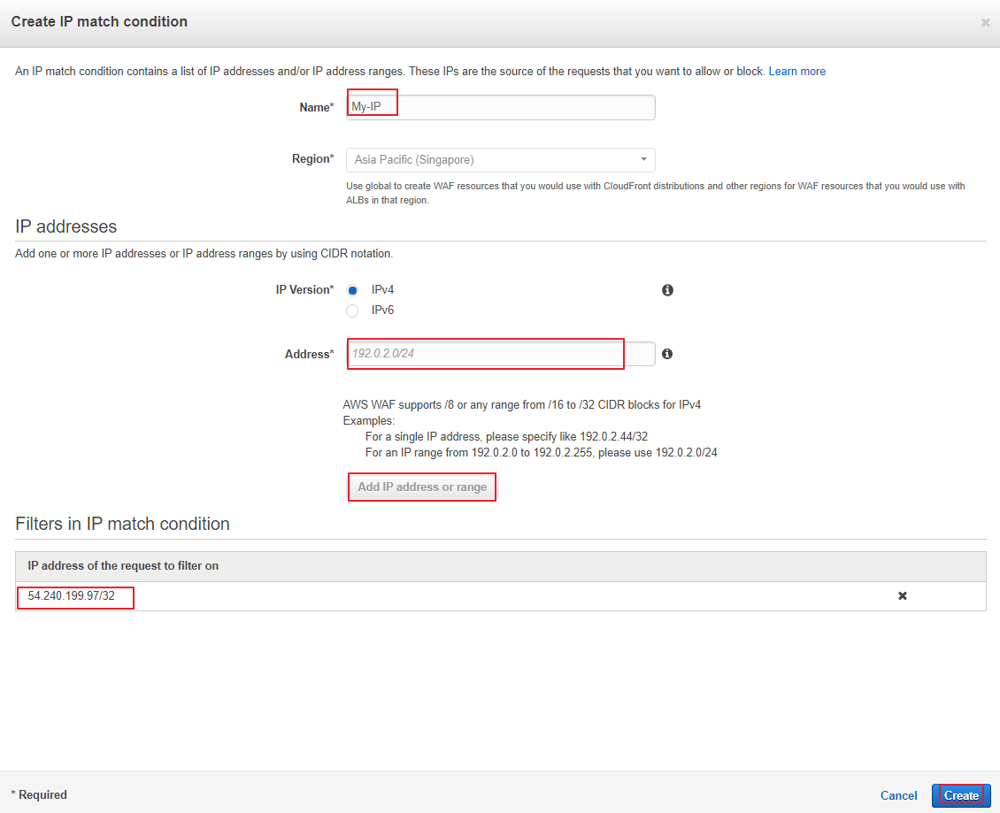
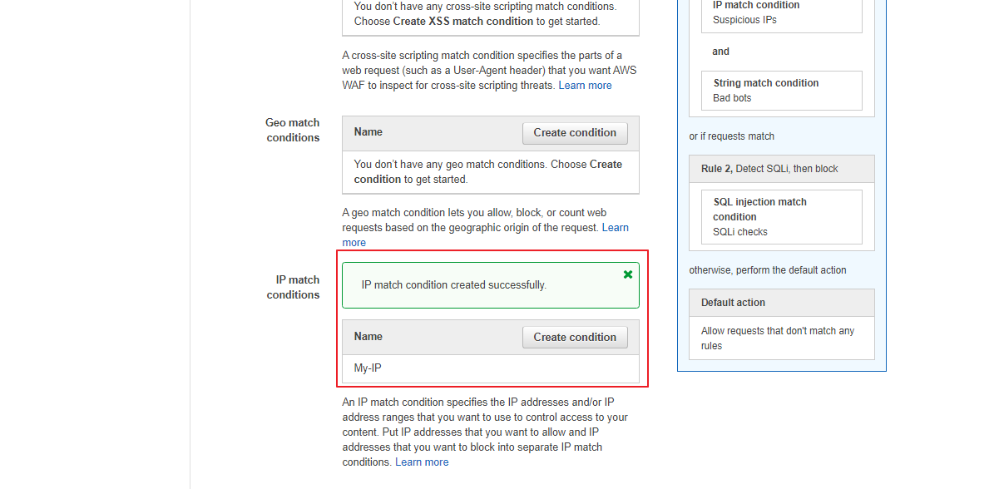
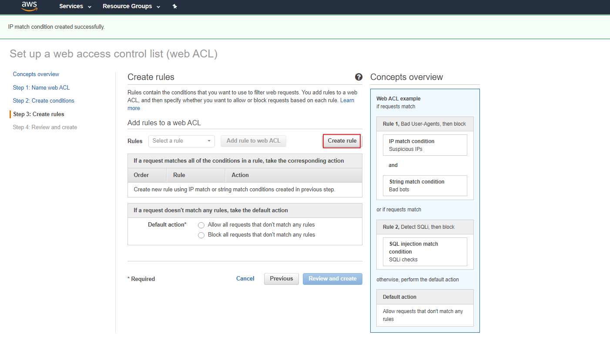
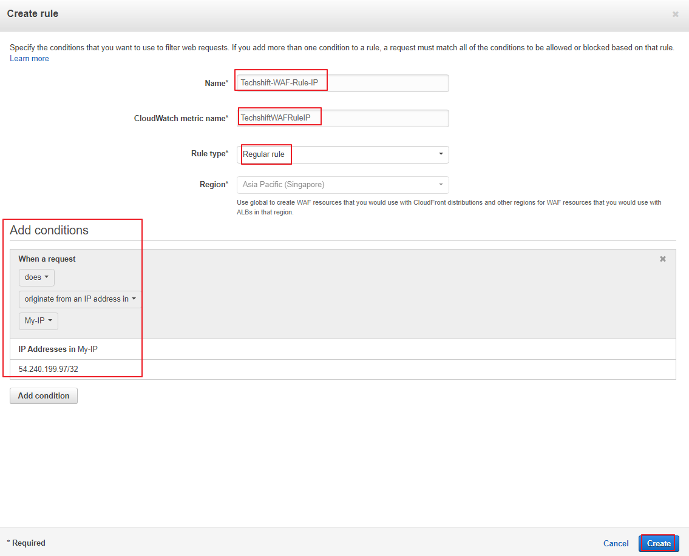
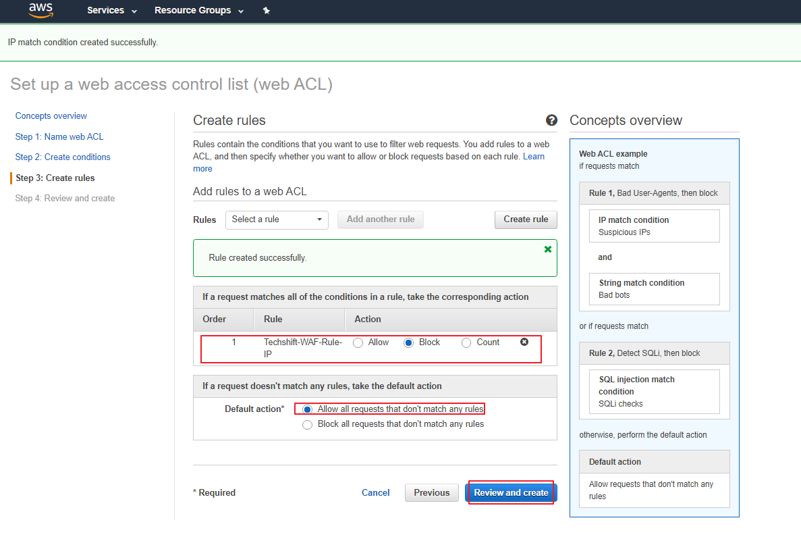

### LAB 6 - AWS WAF

1)  Got to the AWS WAF console and select *Go to AWS WAF*.

2)  Click on *Configure web ACL*. The web ACL wizard will guide us through all
    the steps necessary to create the conditions and rules that are necessary
    that are needed in a Web ACL.

3)  We will be presented the anatomy of a WEB ACL. Simply click *Next* at this
    stage.

4)  Fill in the Web ACL name, the region and the resource that you want the ACL
    to be associated with – in this case the ALB *techshift-alb*. Press *Next*
    once done.

5)  Now let’s create a condition. We will choose an *IP match condition* for
    this lab.

6)  Name the condition *My-IP* and add your public IP address in the list of IP
    addresses that will be filtered. You can find your public IP address on
    www.whatismyip.com.

7)  Ensure that the IP is properly added and press *Next*.

8)  In the rule section we will create a rule that will block the access of our
    public IP. Press on the *Create rule* button.

9)  Give the rule a name *Techshift-WAF-Rule-IP* and add a condition as listed
    below. Once done press *Create*.

10)  Set the default action to allow all the request that do not match the
    condition as we want to block only our IP address. Press *Review and
    Create*.

11)  Once you verify the configuration click on *Confirm and Create* and wait for
    the ACL to be created.

Once the creation is completed go ahead and test it on your browser. You will
notice that you are not allowed to access you ALB.

Try to access the ALB on your mobile phone. You should be able to access it.

Proceed to the [next lab (Anaylizing CloudTrail logs with Athena)](../07-CT-Athena-Lab/README.md)
