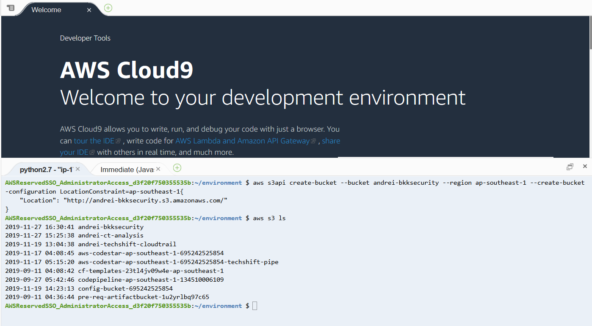
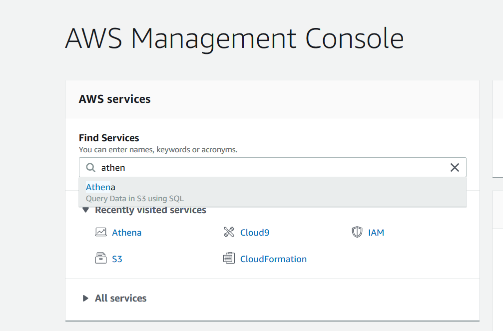
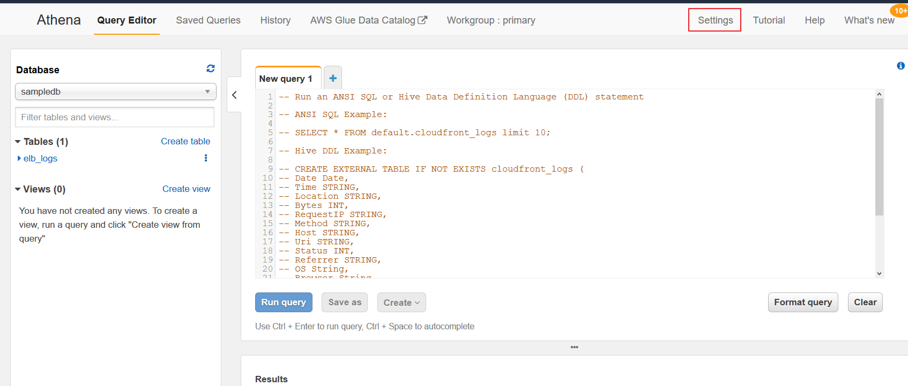
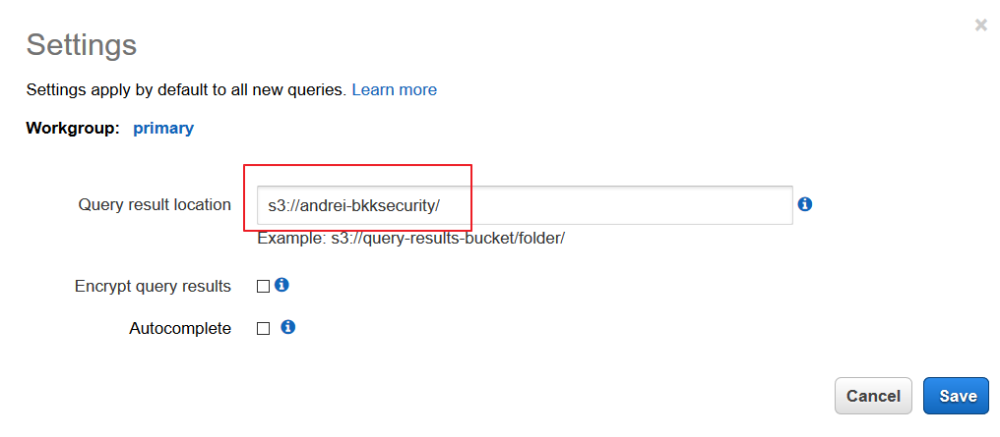
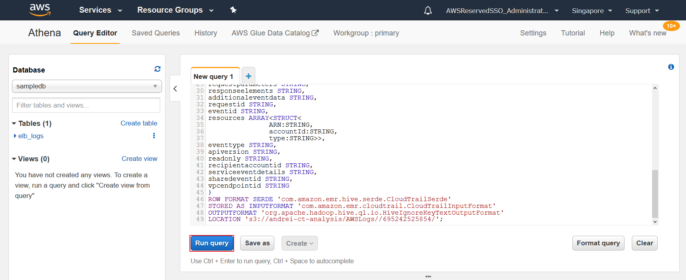
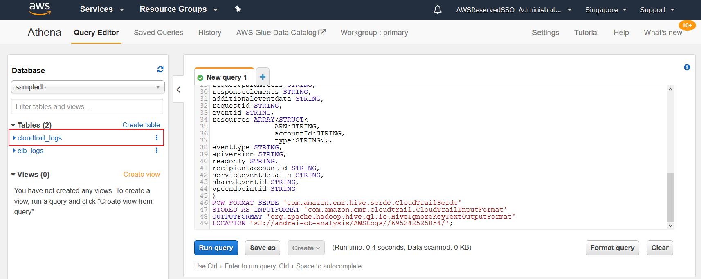
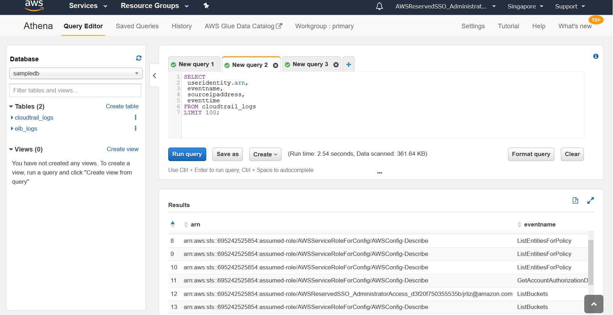

# Analyzing Cloud Trail Logs with Athena

For this exercise, we will be analyzing audit trails that have been generated throughout the Immersion Day activities using AWS Athena.

1. For this exercies we will need an S3 bucket to store Athena query results. To create an S3 bucket execute the following command in the Cloud9 Terminal

 **:heavy_exclamation_mark: Make sure you use your replace the bucket name in the command below with a unique name.**

```
aws s3api create-bucket --bucket aws-athena-query-results-<YOUR ACCOUNT ID>-us-east-1 --region us-east-1 

```


2. Go to the Athena Console



3. Press *Get Started*

4. You may see a warning to _set up a query result location in Amazon S3_. Click on the prompt.



5. In the setings area add the name of the bucket that you created in Step 1 of this lab. Once done click *Save*. You can optionally enable _Encrypt query results_ and _Autocomplete_.



6. In the Query Editor Copy-Paste the extract bellow.

 **:heavy_exclamation_mark: Make sure you change the ___s3://CloudTrail_bucket_name/AWSLogs/Account_ID/___ with the name and account ID of your Cloud Trail Bucket.**

```
CREATE EXTERNAL TABLE cloudtrail_logs (
eventversion STRING,
useridentity STRUCT<
               type:STRING,
               principalid:STRING,
               arn:STRING,
               accountid:STRING,
               invokedby:STRING,
               accesskeyid:STRING,
               userName:STRING,
sessioncontext:STRUCT<
attributes:STRUCT<
               mfaauthenticated:STRING,
               creationdate:STRING>,
sessionissuer:STRUCT<
               type:STRING,
               principalId:STRING,
               arn:STRING,
               accountId:STRING,
               userName:STRING>>>,
eventtime STRING,
eventsource STRING,
eventname STRING,
awsregion STRING,
sourceipaddress STRING,
useragent STRING,
errorcode STRING,
errormessage STRING,
requestparameters STRING,
responseelements STRING,
additionaleventdata STRING,
requestid STRING,
eventid STRING,
resources ARRAY<STRUCT<
               ARN:STRING,
               accountId:STRING,
               type:STRING>>,
eventtype STRING,
apiversion STRING,
readonly STRING,
recipientaccountid STRING,
serviceeventdetails STRING,
sharedeventid STRING,
vpcendpointid STRING
)
ROW FORMAT SERDE 'com.amazon.emr.hive.serde.CloudTrailSerde'
STORED AS INPUTFORMAT 'com.amazon.emr.cloudtrail.CloudTrailInputFormat'
OUTPUTFORMAT 'org.apache.hadoop.hive.ql.io.HiveIgnoreKeyTextOutputFormat'
LOCATION 's3://security-id-cloudtrail-logs-<AWS ACCOUNT ID>-us-east-1
/AWSLogs/<AWS ACCOUNT ID>/CloudTrail/';
```



7. Once the command is successfully executed you will see a new table created



8. Open a new TAB in the Query Editor and paste the following command to see who executed commands on our account.

```
SELECT
 useridentity.arn,
 eventname,
 sourceipaddress,
 eventtime
FROM cloudtrail_logs
LIMIT 100;
```

9. Execute the command and check the results



[Go back to the begining](/../../)
