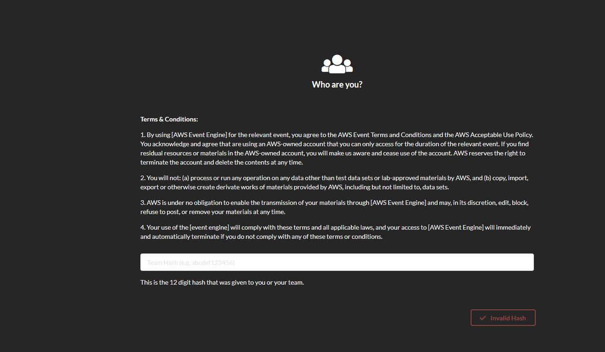
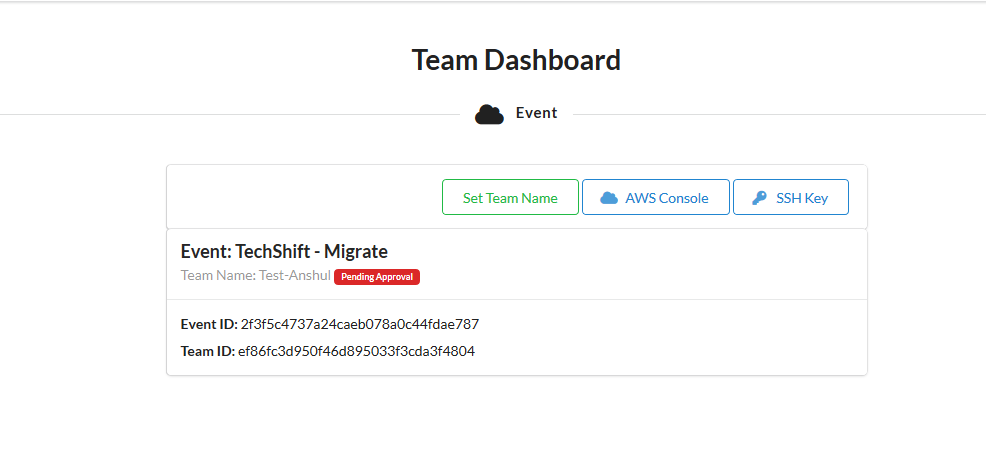
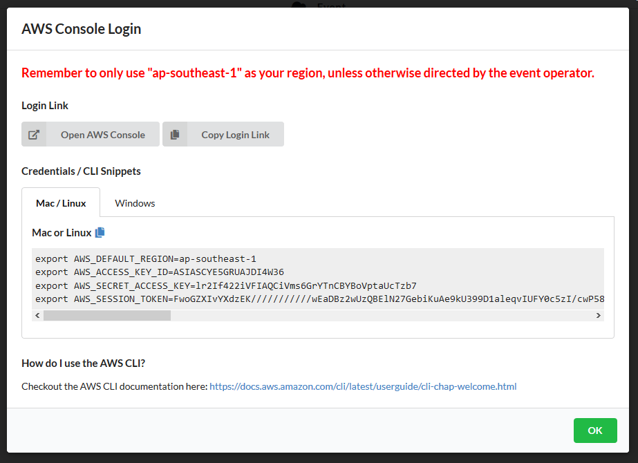
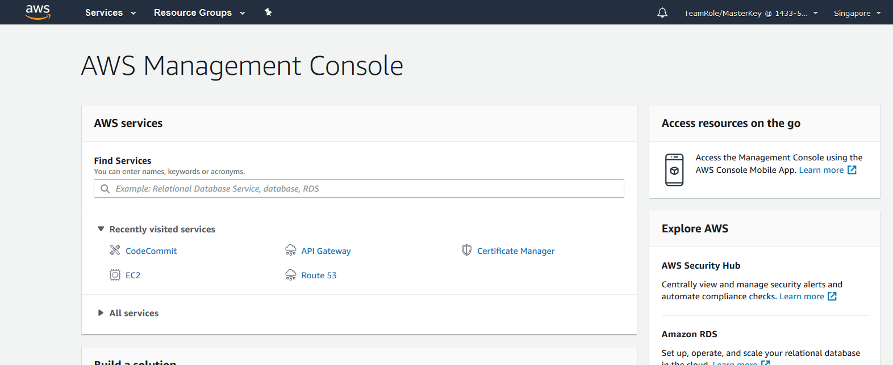

# AWS Security Workshop

## Introduction
By doing this labs you will understand the basic services and security concepts that you need to implement in your AWS Account.

[0. Prerequisites Lab](00-Prerequisites-Lab/README.md)

[1. CloudTrail Lab](01-CloudTrail-Lab/README.md)

[2. GuardDuty Lab](02-GuardDuty-Lab/README.md)

[3. Config Lab](03-Config-Lab/README.md)

[4. KMS Lav](04-KMS-Lab/README.md)

[5. Secrets Manager Lab](05-Secrets-Manager-Lab/README.md)

[6. WAF Lab](06-WAF-Lab/README.md)

[7. Analyze CloudTrail logs with Athena Lab](07-CT-Athena-Lab/README.md)

## How to login to your lab environment via Event Engine

Before starting the labs yo will receive a hash key to access your AWS environment. You will key in this hash key in Event Engine.

Event Engine address: https://dashboard.eventengine.run/login

Set up your team name if you wish. To access te console click on __AWS Console__

After that click on __Open Cosole__

You will see the AWS Console opening up

